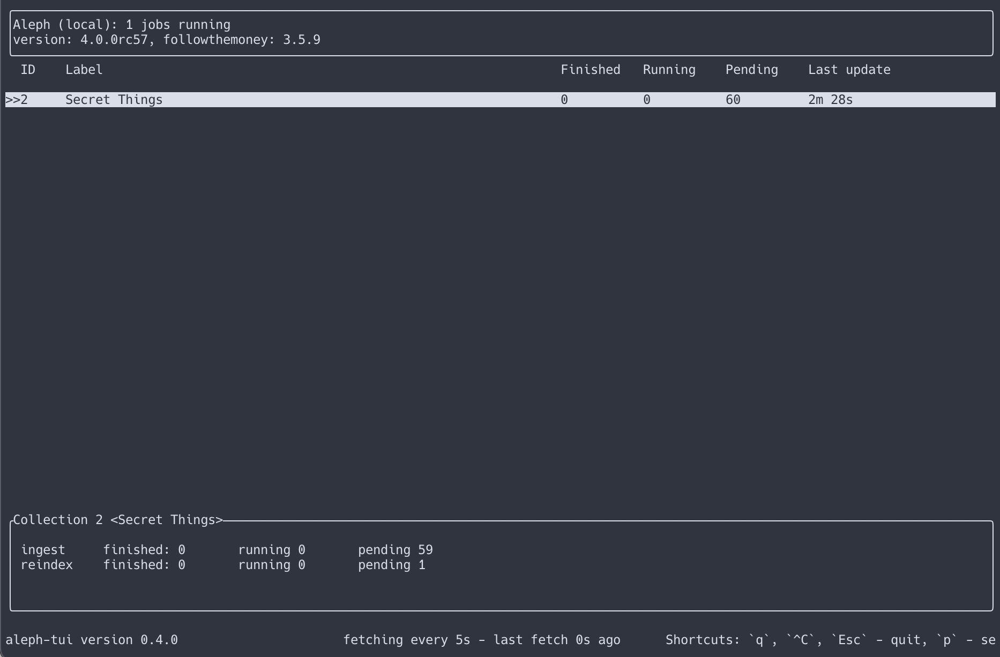
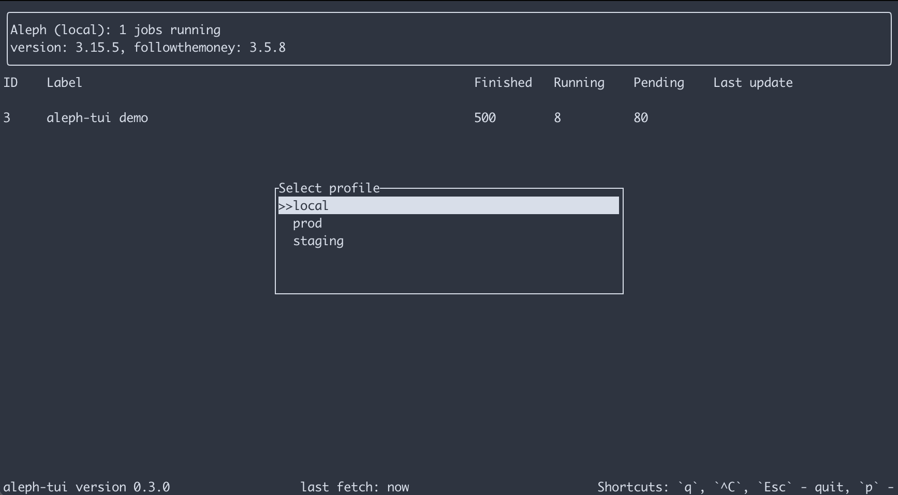

# aleph-tui

This is a text UI for [aleph](https://www.github.com/alephdata/aleph). It allows one to monitor the status of an Aleph instance in real time. It uses the Aleph API to retrieve this information and shows roughly the same data one would see on Aleph's status page.




## Installation

Check the individual [release pages](https://github.com/stchris/aleph-tui/releases) for instructions.

On mac OS:

```sh
brew install stchris/homebrew-formulae/aleph-tui
```

## Configuration

`aleph-tui` assumes the configuration to live in `$HOME/.config/aleph-tui.toml`. It allows you to connect to multiple Aleph instances through `profiles`. Here is an example file:

```toml
default = "local"

[profiles]
  [profiles.local]
  url = "http://localhost:8080/"
  token = "<YOUR API TOKEN HERE>"

  [profiles.my-aleph]
  url = "https://my.aleph.instance/"
  token = "<YOUR API TOKEN HERE>"
```

Find your personal API token by going to `/settings` on your Aleph instance and copying the value from the `API Secret Access Key` field.

`default` defines the profile to be loaded when `aleph-tui` starts up.
